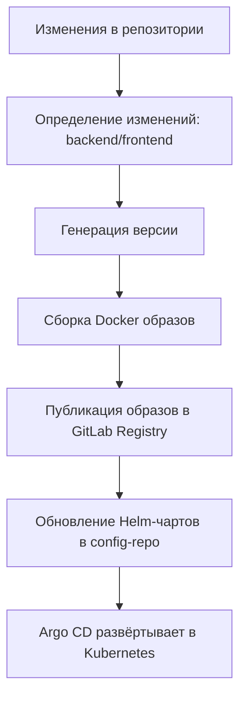

## Описание

Этот раздел описывает структуру репозитория приложения и реализованный конвейер `CI/CD`, использующий `GitLab CI`.  
Архитектура репозитория состоит из двух приложений - backend (`Go`) и frontend (`Vue`), а также набора общих CI-шаблонов, упрощающих сборку Docker-образов, версионирование и деплой через `Helm`.

## Структура репозитория

Ниже представлена структура проекта, включающая backend, frontend и библиотеку GitLab CI-шаблонов.

### Дерево файлов репозитория




    
    
      
      
      
    

    
      
      
      
      
      
      
      
      
    

    
      
      
      

      
      
      
      
      
      
      
      
      
      
    

    
    
    




## Общая концепция CI/CD

CI/CD построен по следующим принципам

### **1. Единый конвейер на уровне корня репозитория**
Файл `.gitlab-ci.yml` в корне агрегирует пайплайны backend и frontend и подключает общие CI-шаблоны:

- автоматическое версионирование (`version.gitlab-ci.yml`)
- сборка Docker-образов (`docker-build.gitlab-ci.yml`)
- Helm-деплой (`helm-deploy.gitlab-ci.yml`)

### **2. Микросервисы внутри одного монорепозитория**

Backend и frontend имеют собственные `.gitlab-ci.yml`, что позволяет:

- запускать отдельные сборки при изменениях только в нужной части
- разделять настройки Docker-образов
- иметь отдельные Helm-чарты при необходимости

### **3. Абстракция повторяемых шагов через `.lib`**

Директория `.lib` содержит три ключевых CI-шаблона

| Шаблон                       | Назначение                                                  |
|------------------------------|-------------------------------------------------------------|
| `version.gitlab-ci.yml`      | Автоматическое семантическое версионирование                |
| `docker-build.gitlab-ci.yml` | Сборка и публикация Docker образов                          |
| `helm-deploy.gitlab-ci.yml`  | Деплой приложения в Kubernetes через Helm и ArgoCD (gitops) |

Это позволяет сокращать дублирование и обеспечивать единообразие пайплайнов.

## Основной CI / CD конвейер

### Версионирование

**Подключение**

```yaml {filename=".sh",linenos=table}
include:
  - local: ".lib/version.gitlab-ci.yml"
```

**Функциональность**

* вычисление SemVer версии (например, `0.1.5-17`)
* публикация версии в job artifacts
* использование версии в образах и Helm-чартах

## CI / CD для backend

#### Файл `backend/.gitlab-ci.yml`:

* триггеры по изменениям: `only: [backend/*]`
* сборка Go-приложения
* тесты
* сборка Docker-образа через `.lib/docker-build.gitlab-ci.yml`

**Параметры**

* путь к Dockerfile: `backend/Dockerfile`
* Docker context: `/backend`
* имя образа: `backend`

## CI / CD для frontend

#### Файл `frontend/.gitlab-ci.yml`:

* зависимости Node.js (npm or yarn)
* сборка SPA проекта
* подготовка сборки Nginx
* сборка Docker-образа через `.lib/docker-build.gitlab-ci.yml`

**Параметры**

* путь к Dockerfile: `frontend/Dockerfile`
* context: `frontend`
* имя образа: `frontend`

## Docker-build template (.lib/docker-build.gitlab-ci.yml)

#### Возможности

* автоматическая сборка Docker-образа
* тегирование в формате
  `registry/app:${CI_COMMIT_SHA}`
  `registry/app:${VERSION}`
* push в GitLab Container Registry

**Использование**

```yaml {filename=".sh",linenos=table}
include:
  - local: ".lib/docker-build.gitlab-ci.yml"

docker-build:
  variables:
    DOCKER_CONTEXT: "./backend"
    DOCKERFILE_PATH: "./backend/Dockerfile"
```

## Helm-deploy template (.lib/helm-deploy.gitlab-ci.yml)

- реализация GitOps-подхода: пайплайн **не выполняет `helm upgrade` сам**, а правит конфигурационный репозиторий с Helm-чартами
- копирование базового `values.yaml` в файл окружения `values-${CI_ENVIRONMENT_NAME}.yaml`
- обновление тега Docker-образа:
  - поле `.${DEPENDENCY_CHART_NAME}.image.tag` в `values-${CI_ENVIRONMENT_NAME}.yaml` получает значение `${VERSION}`
- обновление `appVersion` в `Chart.yaml` до `${VERSION}`
- коммит и push изменений в отдельный конфигурационный репозиторий (`CONFIG_REPO`), откуда уже внешний CD-инструмент (Argo CD) применяет изменения в кластере

**Пример использования (шаблон из `.lib`)**

```yaml {filename=".sh",linenos=table}
include:
  - local: ".lib/helm-deploy.gitlab-ci.yml"

deploy:
  extends: .deploy_template
```

**Окружение определяется автоматически в самом шаблоне через `rules`**

* для ветки develop — `CI_ENVIRONMENT_NAME=dev`;
* для ветки main — `CI_ENVIRONMENT_NAME=prod`, деплой в prod `when: manual`.

## Полный CI/CD процесс






## Итог

* автоматическое версионирование
* сборку Docker-образов backend и frontend
* публикацию артефактов в GitLab Registry
* деплой в Kubernetes через Helm
* разделение и независимость пайплайнов
* переиспользуемые шаблоны в `.lib`

## Далее

Перейти в раздел


  


